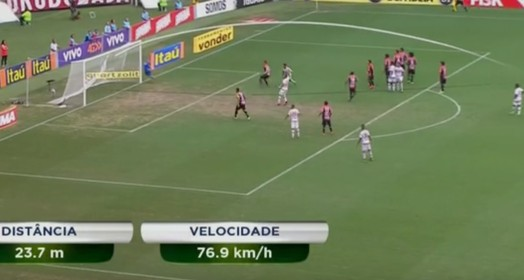
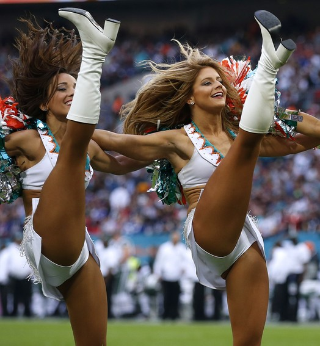

## Banner G1

Banner estilo o do globoesporte.globo.com

[veja o exemplo](http://brazleonardo.github.io/Banner-G1/)


## Bibliotecas necessárias 
- jQuery
- Owl Carousel
- Bootstrap

## Blocos de código para o funcionamento.

## HTML 
- index.html
```html
<!DOCTYPE html>
<html>
    <head>
      <meta charset="utf-8">
        <title>Banner estilo globoesporte</title>         
        <link href='https://fonts.googleapis.com/css?family=Open+Sans:400,700,600' rel='stylesheet' type='text/css'>
        <link href="dist/css/vendor.min.css" rel="stylesheet">
        <link href="dist/css/styles.min.css" rel="stylesheet">
    </head>
    <body>

     <main class="wrap">

    <div class="container">

        <div class="banner">

          <div class="item">
            <div class="col-xs-6 col-md-6">
                <a href="#">
                    
                    <div class="desc txt-right">
                      <h1>Para <br> Inglês ver</h1>
                      <h3>NFL em Wembley e recorde de brasileiro <br> em rodada de folga para Tom Brady</h3>
                    </div>
                </a>
            </div>
            <div class="col-xs-6 col-md-6">
              <a href="#">
                
                <div class="desc txt-right">
                  <h1>Para <br> Inglês ver</h1>
                  <h3>NFL em Wembley e recorde de brasileiro <br> em rodada de folga para Tom Brady</h3>
                </div>
              </a>
              <a href="#">
                
                <div class="desc txt-left">
                  <h1>Para <br> Inglês ver</h1>
                  <h3>NFL em Wembley e recorde de brasileiro <br> em rodada de folga para Tom Brady</h3>
                </div>
              </a>
            </div>
          </div>

          <div class="item">
            <div class="col-xs-6 col-md-6">
                <a href="#">
                    
                    <div class="desc txt-left">
                      <h1>Para <br> Inglês ver</h1>
                      <h3>NFL em Wembley e recorde de brasileiro <br> em rodada de folga para Tom Brady</h3>
                    </div>
                </a>
            </div>
            <div class="col-xs-6 col-md-6">
              <a href="#">
                
                <div class="desc txt-right">
                  <h1>Para <br> Inglês ver</h1>
                  <h3>NFL em Wembley e recorde de brasileiro <br> em rodada de folga para Tom Brady</h3>
                </div>
              </a>
              <a href="#">
                
                <div class="desc txt-right">
                    <h1>Para <br> Inglês ver</h1>
                    <h3>NFL em Wembley e recorde de brasileiro <br> em rodada de folga para Tom Brady</h3>
                </div>
              </a>
            </div>
          </div>

          <div class="item">
            <div class="col-xs-6 col-md-6">
              <a href="#">
                
                <div class="desc txt-right">
                  <h1>Para <br> Inglês ver</h1>
                  <h3>NFL em Wembley e recorde de brasileiro <br> em rodada de folga para Tom Brady</h3>
                </div>
              </a>
            </div>
            <div class="col-xs-6 col-md-6">
              <a href="#">
                
                <div class="desc txt-left">
                  <h1>Para <br> Inglês ver</h1>
                  <h3>NFL em Wembley e recorde de brasileiro <br> em rodada de folga para Tom Brady</h3>
                </div>
              </a>
              <a href="#">
                
                <div class="desc txt-left">
                  <h1>Para <br> Inglês ver</h1>
                  <h3>NFL em Wembley e recorde de brasileiro <br> em rodada de folga para Tom Brady</h3>
                </div>
              </a>
            </div>
          </div>

        </div>

     </div>

    </main>


      <script src="dist/js/vendor.min.js" type="text/javascript"></script>
      <script src="dist/js/scripts.min.js" type="text/javascript"></script>
    </body>
</html>
```

## Código CSS
- styles.css
```css
* {margin: 0; padding: 0; vertical-align: baseline; font-family: 'Open Sans', sans-serif;}

body {background-color: #333;}

.banner {width: 100%; float: left; margin-top: 60px; position: relative;}
.banner .owl-wrapper .item a {width: 100%; height: 100%; float: left; position: relative; color: #fff; overflow: hidden; border-radius: 5px; margin-bottom: 8px;}
.banner .owl-wrapper .item a .desc {width: 100%; position: absolute; bottom: 0px; padding: 20px; background-image: linear-gradient(to bottom, transparent, #000); border-bottom-left-radius: 5px; border-bottom-right-radius: 5px;}
.banner .owl-wrapper .item a .desc h1 {text-transform: uppercase; font-size: 35px; margin: 0 0 10px; font-weight: 700; text-shadow: 0 0 3px #000;}
.banner .owl-wrapper .item a .desc h3 {font-size: 20px; font-weight: 600; margin: 0; text-shadow: 0 0 3px #000;}
.banner .owl-wrapper .item a .desc.txt-left {left: 0; text-align: left;}
.banner .owl-wrapper .item a .desc.txt-right {right: 0; text-align: right;}
.banner img {width: 100%; height: auto; border-radius: 5px; box-shadow: 0 0 3px #555; transition: 0.4s ease;}
.banner .owl-controls .owl-pagination {display: table; margin: auto;}
.banner .owl-controls .owl-page {width: 15px; height: 15px; background-color: #ccc; border-radius: 100%; float: left; margin: 10px 2px;}
.banner .owl-controls .owl-page.active {background-color: #429CD7;}
.banner .owl-controls .owl-buttons {width: 100%; position: absolute; top: 43%; left: 0;}
.banner .owl-controls .owl-buttons .owl-prev {width: 41px; height: 56px; float: left; text-indent: -3000px; overflow: hidden; background-image: url('prev.png'); margin-left: -40px;}
.banner .owl-controls .owl-buttons .owl-next {width: 41px; height: 56px; float: right; text-indent: -3000px; overflow: hidden; background-image: url('next.png'); margin-right: -40px;}

.banner .owl-wrapper .item a:hover img {transform: scale(1.09);}

@media only screen and (max-width: 1200px) {
  .banner .owl-controls .owl-buttons {top: 41%;}
  .banner .owl-controls .owl-buttons .owl-prev {margin-left: 20px;}
  .banner .owl-controls .owl-buttons .owl-next {margin-right: 20px;}
}
```

## Script JS
-- scripts.js
```javascript
$(function(){
   $(".banner").owlCarousel({
        autoPlay: 5000,
        navigation : true, 
        slideSpeed : 300,
        paginationSpeed : 400,
        singleItem:true
      });
});
```
